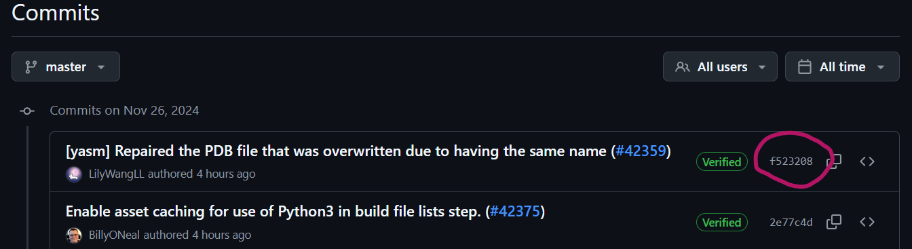
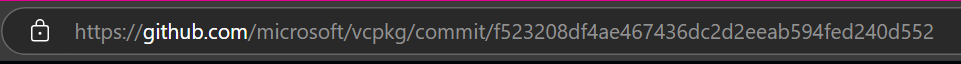

# `Skyrim C++ Libraries`


## `vcpkg` + `xmake`


This is a registry of my C++ libraries for Skyrim modding.

They are provided in both `vcpkg` and `xmake` format.

# The Libraries


- [`...`](#)
- [`...`](#)
- [`...`](#)
- [`...`](#)

# Build Tool Configuration

## `xmake`

Configuring `xmake` to use this package registry couldn't be easier:

```lua
-- This is the important line:
add_repositories("SkyrimScriptingBeta https://github.com/SkyrimScriptingBeta/Packages.git")

-- Then you can get the packages like this:
add_requires("some-library-from-this-registry")

-- And use it normally from targets:
target("my-target")
    set_kind("binary")
    add_files("src/*.cpp")
    add_packages("some-library-from-this-registry")
```

## `vcpkg`

Custom registries for `vcpkg` are a bit more involved, but still easy to set up.

### `vcpkg` Configuration

To allow downloading packages from registries, you need to create a `vcpkg-configuration.json` file:

#### `vcpkg-configuration.json`

```json
{
    "default-registry": {
        "kind": "git",
        "repository": "https://github.com/microsoft/vcpkg.git",
        "baseline": "c698ac9a9dfd33fe7364ef75d32b1aacb64f5a23"
    },
    "registries": [
        {
            "kind": "git",
            "repository": "https://github.com/SkyrimScriptingBeta/Packages.git",
            "baseline": "ed2c8705bccf9dc4c5393b6a9ffb35f8310424f8",
            "packages": ["some-library-from-this-registry"]
        }
    ]
}
```

You should update the `baseline` values to the latest commit hash of the respective repositories.

A `baseline` is the same as a `commit` identifier in a git repository.

##### `vcpkg` Baseline

You can get the latest up-to-date `baseline` value from here:

https://github.com/microsoft/vcpkg/commits/master/

Click on the little identifier hash to get the full commit hash:



Then you can take the long hash from the URL:



Copy that into the `baseline` field in the `vcpkg-configuration.json` file.

##### `SkyrimScriptingBeta` Baseline

You can repeat the same process for the SkyrimScriptingBeta repository.

You can get the latest commit hash from here:

https://github.com/SkyrimScriptingBeta/Packages/commits/main/
