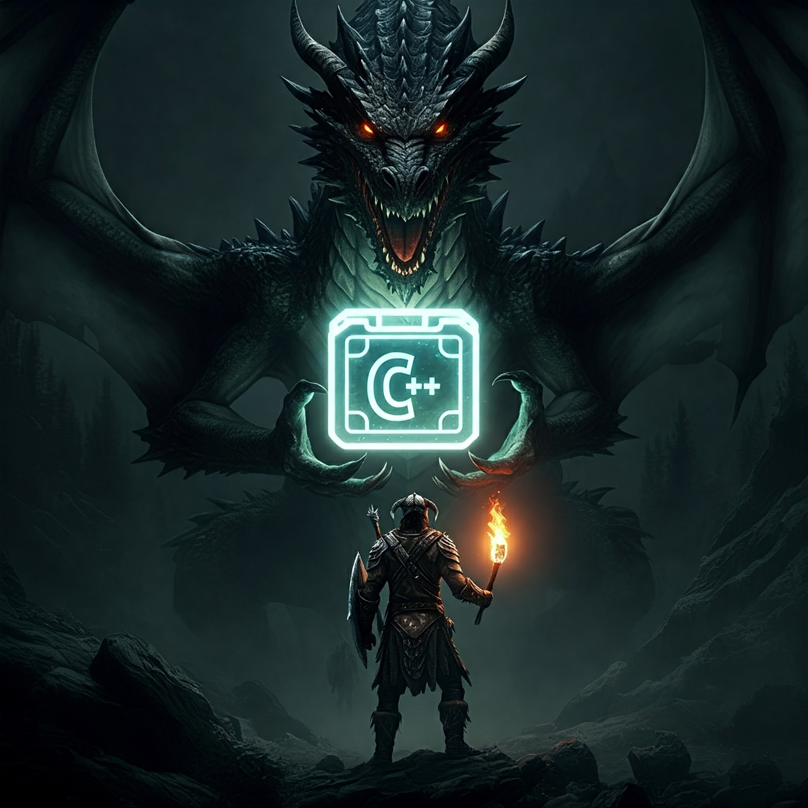
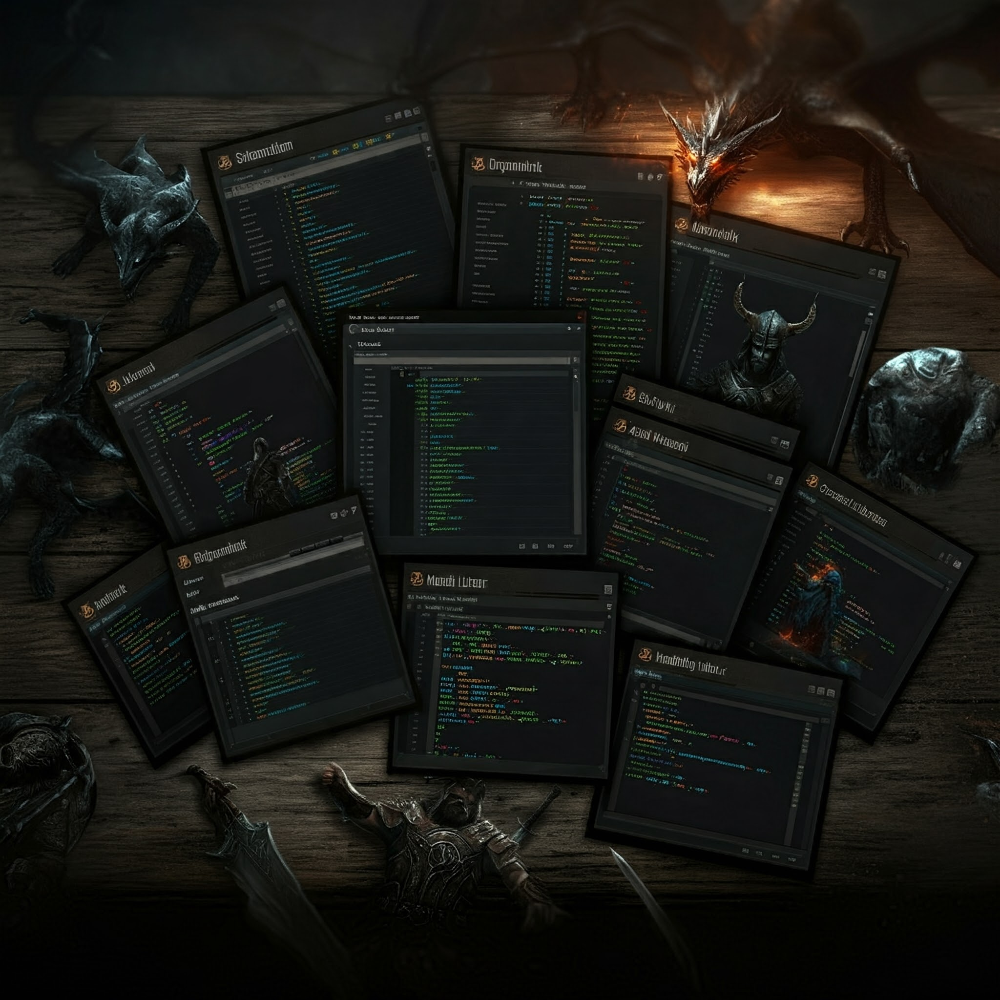

# `Skyrim C++ Libraries`

## `vcpkg` + `xmake`

This is a registry of my C++ libraries for Skyrim modding.

They are provided in both `vcpkg` and `xmake` format.

# The Libraries

- [`...`](#)
- [`...`](#)
- [`...`](#)
- [`...`](#)

# Build Tool Configuration

## `vcpkg`

## `xmake`